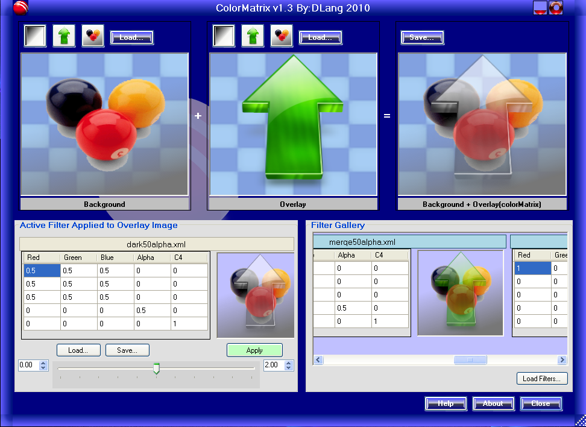

## Welcome to Dennis Lang's  Source Code and Performance Metrics  

[\[https://landenlabs.com \]](https://landenlabs.comindex.html)
Linkedin: https://www.linkedin.com/pub/1/119/293

Updated: 7-Apr-2010

* * *     

C# - ColorMatrix v1.4
---------------------

Download:  
**colormatrix** C# source code and executables (xp32/net3.5):*   
*   [Download v1.4 EXE - 1,105 KB](colormatrix-v1.4.exe)
*   [Download v1.4 source - 2,259 KB](colormatrix-v1.4-src.zip)

This C# application demonstrates the effect of using the ColorMatrix operator on an image. This program contains several sample matrix filters which you can select and modify. The top portion of the program interface contains three images. A background image, an overlay and the result of applying the color matrix on the overlay rendered on top of the background image. Each of the three panels display their image over a checkerboard background to make it easier to see partial transparent areas (alpha < 255). The bottom section of the interface shows the active color matrix filter on the left and a gallery of pre-built filters on the right.

Program Features include:
-------------------------

> ### Color Matrix Features:
> 
> *   Three quick image load buttons for the background and overlay image
> *   Load user images into backgroud or overlay
> *   Save final image
> *   Edit color matrix
> *   Select one or more matrix cells and use slider bar to modify selections and see results
> *   Save and Load color matrix with image.
> *   Select from sample filters
> *   Load additional sample filters.
> *   Spinning "about" dialog on open and close (eye candy)
>     
>     ### Other Feaures:
>     
> *   Embedded html help with images
> *   Spinning "about" dialog when it opens and closes
> *   Custom window frame
> *   Embedded zip of ColorMatrix filter samples

[Top](#top)

* * *

WEB Links to related information
--------------------------------

*   [https://www.iceplug.us/cngdi2.htm](https://www.iceplug.us/cngdi2.htm)
*   [https://www.iceplug.us/cngdi6.htm](https://www.iceplug.us/cngdi6.htm)
*   [https://www.c-sharpcorner.com/UploadFile/mahesh/Transformations0512192005050129AM/Transformations05.aspx](https://www.c-sharpcorner.com/UploadFile/mahesh/Transformations0512192005050129AM/Transformations05.aspx)
    

[Top](#top)
    